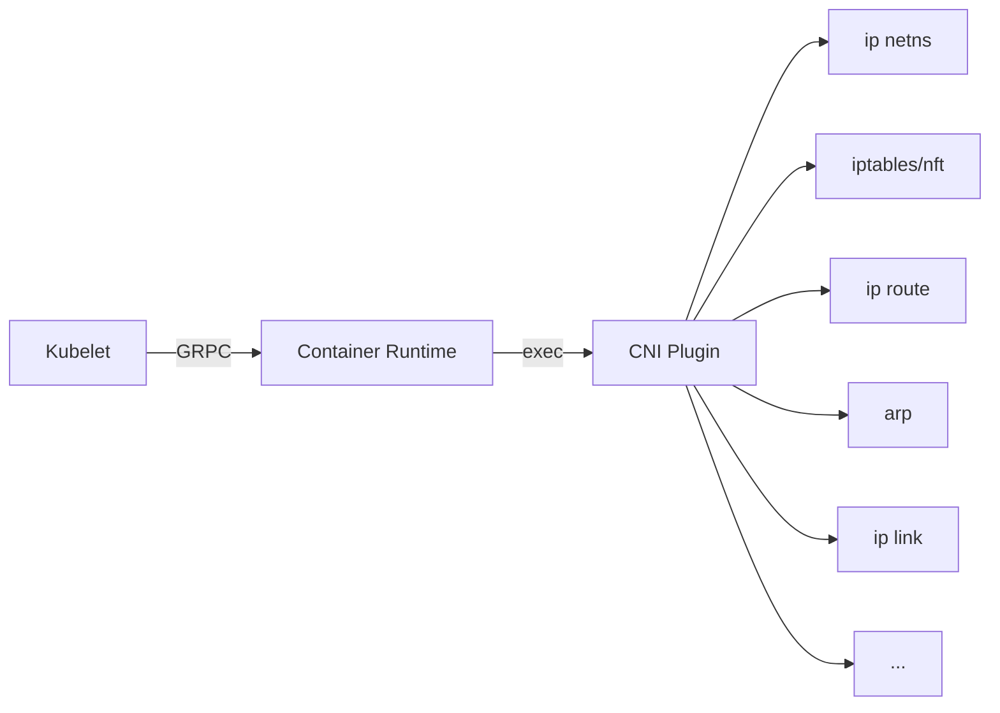

# MNCNI -- My Naive CNI for AKS (in progress)

This is an experimental effort for customizations of CNI on AKS with the byo CNI
feature. This article will be scoped to Linux only, while for most parts Windows
CNI shares the same design, while have a completely different technology stack.

## Deploying Lab env

See [provision.sh](./provision.sh). For each of the below sections, we expect
a new AKS cluster to avoid conflicts of configuring different CNI envs.

## First custom CNI on AKS: Deploy Flannel

To start the adventure, we deploy
[Flannel](https://github.com/flannel-io/flannel) to have a taste of success.

Flannel offers a
[kube-flannel.yaml](https://github.com/flannel-io/flannel/blob/master/Documentation/kubernetes.md#kube-flannelyaml)
for a default deployment. It however doesn't work out-of-box for AKS with byocni
due to AKS doesn't configure `--allocate-node-cidrs` for kube-controller-manager
and flannel expect `node.spec.podCIDR` 
[being configured](https://github.com/flannel-io/flannel/blob/master/Documentation/troubleshooting.md#kubernetes-specific)
.

It will be a different scenario for CNIs such as
[Calico](https://projectcalico.docs.tigera.io/networking/get-started-ip-addresses)
and 
[Cilium](https://docs.cilium.io/en/v1.12/concepts/networking/ipam/cluster-pool/)
, as those offers alternative IP assignment mechanisms.

For Flannel to work, nodeipam controller, a controller among
kube-controller-manager, is [deployed](./nodeipam.yaml) in hostNetwork mode for
configuring the IP address. It is not difficult to implement this logic with
some additional code but let's save the hassle.

So, for a working setting:

```shell
kubectl apply -f nodeipam.yaml
kubectl apply -f https://github.com/flannel-io/flannel/raw/master/Documentation/kube-flannel.yml
```

## Observability

Now we have a working cluster with a custom CNI, but how do we unveil what's
going on for the network preparation?

CNI plugins basically works as below diagram:



Where:

* Kubelet calls with container runtime (Containerd if it is AKS) to
  prepare/teardown sandbox.
* Container runtime, mostly integrated with
  [libcni](https://github.com/containernetworking/cni/tree/master/libcni)
  reads CNI configuration and executes plugins binaries with appropriate
  parameters.

So, to check what CNI plugins has been applied, either tune the container
runtime to log such information, or alternatively use any OS features that can
trace exec calls. strace is a good choice given the requirement. e.g.:

```shell
strace -fvtt -s 2000 -b execve -e trace=execve -p $(pgrep -x containerd) 2>&1 | grep CNI_COMMAND
```

The command assumes containerd is the container runtime, it searches for
`CNI_COMMAND` which is a required env variable for a plugin execution.

To check what's applied to Linux networking, Different tools can be used to
identify activities in the corresponding field.

To give a few examples:

* [nlmon](https://developers.redhat.com/blog/2018/10/22/introduction-to-linux-interfaces-for-virtual-networking#nlmon)
  + tcpdump + wireshark to capture and read all netlink protocols. This includes
  most of the `ip` commands
* [xtables-monitor](https://man7.org/linux/man-pages/man8/xtables-monitor.8.html)
  for tracing iptables changes (only for nft, not legacy).


## naivebridge

In this approach (named naivebridge) we try to mimic what's done in the
[kubenet](https://learn.microsoft.com/en-us/azure/aks/configure-kubenet) AKS
setting.

So below is a comparison of the current "kubenet" setting at time of writing,
vs our approach.

|               | "kubenet"               | naivebridge |
| ------------- | ---------                  | ------------- |
| nodeipam      | kube-controller-manager    | [nodeipam.yaml](./nodeipam.yaml) |
| routing       | azure-cloud-provider -> UDR | `ip route` with daemonset |
