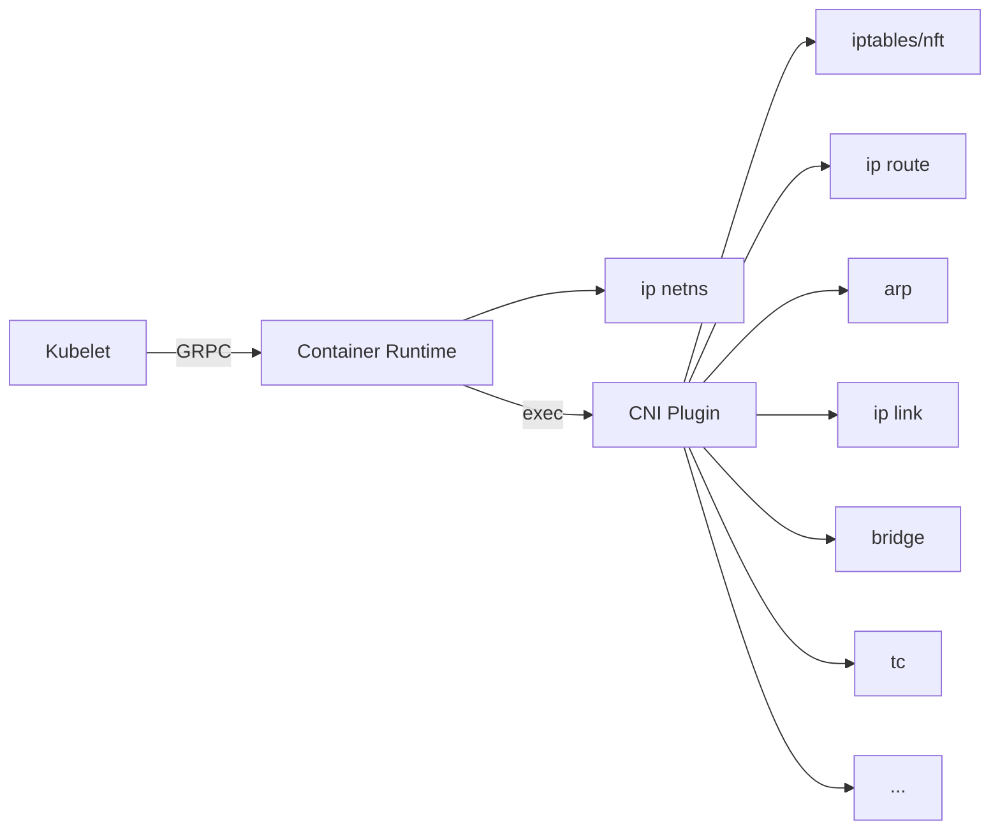

# MNCNI -- My Naive CNI for AKS (in progress)

This is an experimental effort for customizations of CNI on AKS with the byo CNI
feature. This article will be scoped to Linux only, while for most parts Windows
CNI shares the same design, while have a completely different technology stack.

## Deploying Lab env

See [provision.sh](./provision.sh). For each of the below sections, we expect
a new AKS cluster to avoid conflicts of configuring different CNI envs.

## First custom CNI on AKS: Deploy Flannel

To start the adventure, we deploy
[Flannel](https://github.com/flannel-io/flannel) to have a taste of success.

Flannel offers a
[kube-flannel.yaml](https://github.com/flannel-io/flannel/blob/master/Documentation/kubernetes.md#kube-flannelyaml)
for a default deployment. It however doesn't work out-of-box for AKS with byocni
due to AKS doesn't configure `--allocate-node-cidrs` for kube-controller-manager
and flannel expect `node.spec.podCIDR` 
[being configured](https://github.com/flannel-io/flannel/blob/master/Documentation/troubleshooting.md#kubernetes-specific)
.

It will be a different scenario for CNIs such as
[Calico](https://projectcalico.docs.tigera.io/networking/get-started-ip-addresses)
and 
[Cilium](https://docs.cilium.io/en/v1.12/concepts/networking/ipam/cluster-pool/)
, as those offers alternative IP assignment mechanisms.

For Flannel to work, nodeipam controller, a controller among
kube-controller-manager, is [deployed](./nodeipam.yaml) in hostNetwork mode for
configuring the IP address. It is not difficult to implement this logic with
some additional code but let's save the hassle.

So, for a working setting:

```shell
kubectl apply -f nodeipam.yaml
kubectl apply -f https://github.com/flannel-io/flannel/raw/master/Documentation/kube-flannel.yml
```

## Observability

Now we have a working cluster with a custom CNI, but how do we unveil what's
going on for the network preparation?

CNI plugins basically works as below diagram:



Where:

* Kubelet calls with container runtime (Containerd if it is AKS) to
  prepare/teardown sandbox.
* Container runtime, mostly integrated with
  [libcni](https://github.com/containernetworking/cni/tree/master/libcni)
  reads CNI configuration and executes plugins binaries with appropriate
  parameters.

### Observe CNI calls by Containerd debug logs

Containerd currently prints CNI outcome when started with
`containerd --log-level debug`. If systemd is used, locate the containerd
service by `find /etc/systemd -name 'containerd.service'`, modify `Service.ExecStart`
to include the debug flag, then reload:
`systemctl daemon-reload && systemctl restart containerd`. CNI logs (among
other debug information) should show in containerd logs.

Alternatively, add `[debug]` section with `level="debug"`.

### Observe CNI calls by strace

Debug logs of containerd may disrupt runtime settings and show too much detail,
which is less than desirable. Alternatively, any OS level tracing mechanism can
be used, as long as it can capture the execution protocol that CNI uses.
Basically it needs to:

1. Capture exec calls and filter out calls that matches CNI charastics;
2. Capture stdin, stdout of the created process.
3. exit code of the created process. 

strace can be used to capture the exec call, however it will be difficult to not
over-capturing. An example of strace based capture that only includes limited
information:

```shell
strace -fvtt -s900 -bexecve -etrace=execve -p$(pgrep -x containerd) 2>&1 | grep CNI_COMMAND
```

The command assumes containerd is the container runtime, it searches for
`CNI_COMMAND` which is a required env variable for a plugin execution. Noting
this command only satisfies the 1st requirement.

### Observe CNI calls with bpf

Observing CNI calls with ebpf + kprobe is apparently possible. See
[cnisnoop.py](../tracing/cnisnoop.py) which prints CNI calls as they occur.

### Review CNI cached results

[libcni](https://github.com/containernetworking/cni/tree/main/libcni),
the reference implementation of CNI workflow which is used by container
runtimes, stores cached results of CNI calls in `/var/lib/cni/results`.

### Observe underlying Linux networking changes

To check what's applied to Linux networking, Different tools can be used to
identify activities in the corresponding fields.

To give a few examples:

* [nlmon](https://developers.redhat.com/blog/2018/10/22/introduction-to-linux-interfaces-for-virtual-networking#nlmon)
  + tcpdump + wireshark to capture and read all netlink protocols. This includes
  most of the `ip` commands
* [xtables-monitor](https://man7.org/linux/man-pages/man8/xtables-monitor.8.html)
  for tracing iptables changes (only for nft, not legacy).

## Toy CNI plugin: lat

Now we can see what's run by CNI, it is time to see a real-world example of CNI
plugin, to better understand how CNI works, and how it fits in the big picture.
[lat](./lat) is a minimal (~50 lines of bash) yet functioning CNI plugin for
introducing network latency.

### How does lat work

lat works by:

1. Reading pod annotations, this is allowed by CNI capability
   `io.kubernetes.cri.pod-annotations`
   [provided by containerd](https://github.com/containerd/containerd/pull/5026).
2. bash scripting that implements lat to conform CNI specification.
3. [jq](https://github.com/stedolan/jq) for parsing JSON in bash.
4. `tc` with qdisc
   [netem](https://man7.org/linux/man-pages/man8/tc-netem.8.html) for simulating
   latency on nic.

### Install on top of Flannel

To install on top of already working Flannel:

```shell
kubectl create cm -n kube-flannel lat --from-file=lat=lat/lat
kubectl patch cm -n kube-flannel kube-flannel-cfg --patch-file lat/lat.cm.patch.yaml
kubectl patch ds -n kube-flannel kube-flannel-ds --patch-file lat/lat.ds.patch.yaml
```

### Verify extension working

To have a test deployment:

```shell
kubectl apply -f lat/latpod.yaml
```

This deployment configures all its pods to have 50ms latency when sending
any outbound IP packets by having `lat: 50ms` in pod's annotation.

To confirm latency is added, use `curl -v --trace-time http://<cluster-ip>` on
Kubernetes node to confirm latency is more than 50ms.

## naivebridge

In this approach (named naivebridge) we try to mimic what's done in the
[kubenet](https://learn.microsoft.com/en-us/azure/aks/configure-kubenet) AKS
setting.

So below is a comparison of the current "kubenet" setting at time of writing,
vs our approach.

|               | "kubenet"               | naivebridge |
| ------------- | ---------                  | ------------- |
| nodeipam      | kube-controller-manager    | [nodeipam.yaml](./nodeipam.yaml) |
| routing       | azure-cloud-provider -> UDR | `ip route` with daemonset |
