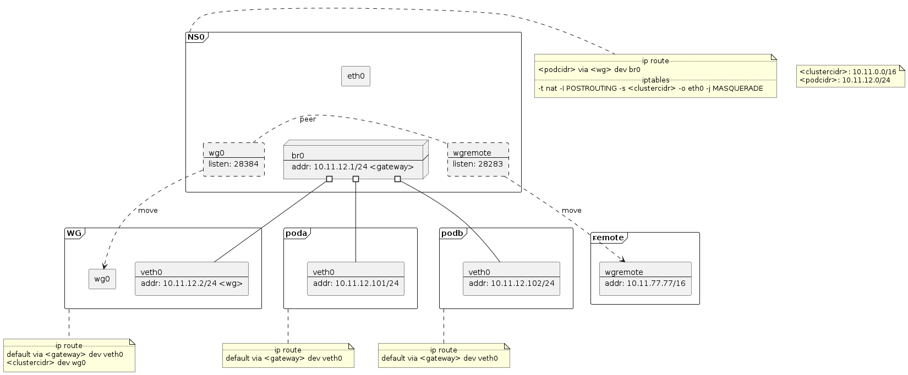

# naivewg proof of concept

This documentation describes how to build a proof-of-concept environment of
naivewg. This is similar to the prototyping process of a CNI solution. Most of
the scripts here are indeed used when prototyping the naivewg solution.

## Prerequisites

* Root access to a Linux box, WSL2 works.
* ip-forwarding enabled
* iproute2
* iptables
* wireguard

On a Debian/Ubuntu box:

```sh
sudo -s
apt-get update && apt-get install -y iproute2 iptables wireguard
```

## Construction Overview



## Setup

```sh
PODCIDR=10.11.12.0/24
CLUSTERCIDR=10.11.0.0/16
GATEWAY_ADDR=10.11.12.1
GATEWAY_IF=10.11.12.1/24
WG_ADDR=10.11.12.2
WG_IF=10.11.12.2/24
PODA_ADDR=10.11.12.101
PODA_IF=10.11.12.101/24
PODB_ADDR=10.11.12.102
PODB_IF=10.11.12.102/24
WG0_LISTEN=28384
REMOTE_LISTEN=28283
REMOTE_ADDR=10.11.77.77
REMOTE_IF=10.11.77.77/16

# namespaces
ip netns add wg
ip netns add remote
ip netns add poda
ip netns add podb

# wg credentials
wg genkey | tee hub.private | wg pubkey > hub.public
wg genkey | tee remote.private | wg pubkey > remote.public

# wg0
ip link add wg0 type wireguard
wg set wg0 listen-port $WG0_LISTEN private-key hub.private \
  peer "`cat remote.public`" endpoint 127.0.0.1:$REMOTE_LISTEN \
  allowed-ips $REMOTE_ADDR
ip link set wg0 netns wg
ip -n wg link set wg0 up
ip -n wg route add $CLUSTERCIDR dev wg0

# remote
ip link add wgremote type wireguard
wg set wgremote listen-port $REMOTE_LISTEN private-key remote.private \
  peer "`cat hub.public`" endpoint 127.0.0.1:$WG0_LISTEN allowed-ips $PODCIDR
ip link set wgremote netns remote
ip -n remote link set wgremote up
ip -n remote address add $REMOTE_IF dev wgremote

# br0
ip link add br0 type bridge
ip link set br0 up
ip address add $GATEWAY_IF dev br0
ip route add $CLUSTERCIDR via $WG_ADDR dev br0

# wg -- br0
ip link add veth0 netns wg type veth peer name vethwg
ip link set vethwg master br0 up
ip -n wg link set veth0 up
ip -n wg address add $WG_IF dev veth0

# poda -- br0
# ip link add vetha type veth peer name veth0 netns poda
ip link add veth0 netns poda type veth peer name vetha
ip link set vetha master br0 up
ip -n poda link set veth0 up
ip -n poda address add $PODA_IF dev veth0
ip -n poda route add default via $GATEWAY_ADDR dev veth0

# podb -- br0
ip link add veth0 netns podb type veth peer name vethb
ip link set vethb master br0 up
ip -n podb link set veth0 up
ip -n podb address add $PODB_IF dev veth0
ip -n podb route add default via $GATEWAY_ADDR dev veth0

# pod -- Internet
iptables -t nat -I POSTROUTING -s $CLUSTERCIDR ! -d $CLUSTERCIDR -j MASQUERADE 
```

## Tests

```sh
# poda <-> podb
ip netns exec poda ping -c 3 $PODB_ADDR
ip netns exec podb ping -c 3 $PODA_ADDR

# node <-> poda/podb
ping -c 3 $PODA_ADDR
ping -c 3 $PODB_ADDR

# poda/podb <-> remote
ip netns exec poda ping -c 3 $REMOTE_ADDR
ip netns exec podb ping -c 3 $REMOTE_ADDR

# poda/podb -> Internet
ip netns exec poda curl -vm3 https://bing.com/
ip netns exec podb curl -vm3 https://bing.com/
```

## Teardown

```sh
ip netns delete wg
ip netns delete remote
ip netns delete poda
ip netns delete podb
ip link delete br0
iptables -t nat -D POSTROUTING -s $CLUSTERCIDR ! -d $CLUSTERCIDR -j MASQUERADE
```
